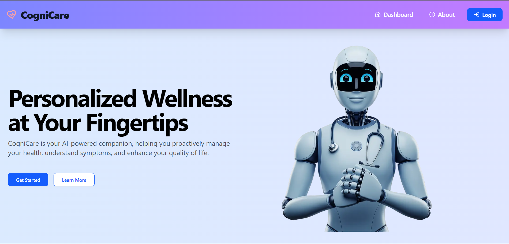

# 🧠 **CogniCare – AI-Powered Health & Wellness Companion**

Hey everyone! I’m excited to present **CogniCare**, an AI-driven health and wellness platform designed to assist users with medical guidance tailored to the Indian audience. CogniCare integrates **Google Gemini AI** with a powerful **RAG (Retrieval-Augmented Generation)** system to provide accurate AI responses backed by a curated medical knowledge base.

This platform empowers users to check symptoms, chat with an AI health assistant, get diet and exercise plans, practice guided meditation, and find nearby doctors or clinics — all in one place.

---

## 🚀 What You Can Do with CogniCare

- 🩺 **AI Symptom Checker:** Submit symptoms and get AI-based health suggestions backed by a knowledge base.
- 💬 **AI Chat Assistant:** Chat with an AI assistant for detailed health advice and remedies.
- 🏥 **Find a Doctor/Clinic:** Search for nearby clinics and doctors, view on map, and call directly.
- 🥗 **Manage Diet Plans:** Receive tailored meal plans.
- 🏋️ **Exercise Guidance:** Exercise routines with sets, reps, and durations.
- 🧘 **Meditation Guides:** Access video and audio-based guided meditation sessions.

---

🔗 [Live Website](https://cogni-care-front.vercel.app)

---
## 📸 Landing Page 
  

---

## ✨ Features

### 🤖 **AI-Powered Health Assistance (Gemini + RAG)**
- AI-driven symptom analysis
- Detailed responses powered by **Gemini AI** and a **RAG Knowledgebase pipeline**
- Knowledge base curated specifically for Indian users

### 📍 **Doctor & Clinic Finder**
- Enter location to find nearby clinics and doctors
- View locations using interactive maps powered by **OpenStreetMap**
- Direct call functionality for listed clinics

### 🩺 **Comprehensive Wellness Support**
- Tailored diet plans with meal breakdowns
- Exercise routines with customizable sets, reps, and durations
- Meditation guides with both text instructions and audio/video support

### 🔐 **Secure Authentication & User Management**
- JWT-based secure login
- Personal dashboard with saved health plans and chats

---

## 🛠️ Tech Stack

| Category         | Technology                                       |
| ---------------- | ------------------------------------------------ |
| **Frontend**     | Next.js, TypeScript, Tailwind CSS                |
| **Backend**      | Node.js, Express.js, MongoDB                     |
| **AI Integration** | Google Gemini API + RAG Pipeline               |
| **State Mgmt**   | Zustand                                          |
| **Auth**         | JWT Authentication                               |
| **Maps**         | OpenStreetMap API, React-Leaflet                 |
| **Utilities**    | Axios, String Similarity (Fuzzy Matching)        |
| **Deployment**   | Vercel                                           |

---

## 🔄 Health Support Workflow

### 🩺 Symptom Checker Flow
1. User submits symptoms through the form
2. The system sends the input to Gemini AI
3. RAG pipeline retrieves context from the medical knowledge base
4. AI responds with probable conditions, suggestions, and next steps

### 💬 AI Chat Flow
1. User initiates a chat for detailed assistance
2. The chat integrates Gemini AI with RAG for deeper, contextual, step-wise responses
3. The AI offers remedies, advice, and explains conditions thoroughly

### 🗺️ Find Doctor Flow
1. User enters a location (text input like "Connaught Place, Delhi")
2. The system searches and matches locations using **OpenStreetMap API**
3. Results are shown on an interactive map with call links to clinics

### 🏋️ Diet, Exercise, Meditation
- Users can access or generate health plans personalized to their needs
- Plans include structured data: meals, exercises with sets/reps, and meditation guides

---

## 💡 Future Enhancements (Planned)
- User health history tracking
- More advanced doctor filtering (by specialization, rating)
- AI-based preventive care suggestions
- Push notifications for reminders (exercise, medication, meditation)

---

## 🙌 Made with ❤️ by **Anirudha Chaudhary**